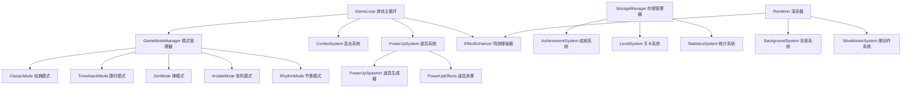

# 设计文档

## 概述

游戏玩法扩展设计基于现有的摄像头水果忍者游戏架构，通过模块化方式添加新功能，确保与现有系统无缝集成。扩展采用插件式架构，每个新功能作为独立模块，可以单独启用或禁用。

**核心扩展模块：**
- **游戏模式管理器 (GameModeManager)**: 管理多种游戏模式
- **连击系统 (ComboSystem)**: 追踪和奖励连续切割
- **道具系统 (PowerUpSystem)**: 特殊道具生成和效果管理
- **特效增强器 (EffectEnhancer)**: 高级视觉特效
- **成就系统 (AchievementSystem)**: 成就追踪和解锁
- **关卡系统 (LevelSystem)**: 关卡进度和解锁
- **背景系统 (BackgroundSystem)**: 动态背景和场景
- **统计系统 (StatisticsSystem)**: 数据追踪和可视化
- **慢动作系统 (SlowMotionSystem)**: 慢动作回放
- **音乐节奏系统 (RhythmSystem)**: 音乐同步玩法

**技术栈保持不变：**
- TypeScript + HTML5 Canvas
- MediaPipe Hands (手势识别)
- Web Audio API (音频)
- LocalStorage (数据持久化)

## 架构

### 扩展系统架构图




### 集成策略

扩展系统通过以下方式与现有架构集成：

1. **GameState 扩展**: 添加新字段而不修改现有逻辑
2. **GameObject 扩展**: 新增子类型（PowerUp, GoldenFruit, FrozenFruit）
3. **GameLoop 钩子**: 在现有更新/渲染循环中插入扩展系统调用
4. **事件驱动**: 使用事件系统解耦模块间依赖

## 组件和接口

### 1. 游戏模式管理器 (GameModeManager)

管理不同游戏模式的切换和规则应用。

```typescript
enum GameMode {
  CLASSIC = 'classic',      // 经典模式：生命值机制
  TIME_ATTACK = 'time_attack', // 限时模式：60秒倒计时
  ZEN = 'zen',              // 禅模式：无炸弹无生命限制
  ARCADE = 'arcade',        // 街机模式：难度递增
  RHYTHM = 'rhythm'         // 节奏模式：音乐同步
}

interface GameModeConfig {
  mode: GameMode;
  hasLives: boolean;           // 是否有生命值
  hasBombs: boolean;           // 是否生成炸弹
  timeLimit: number | null;    // 时间限制（秒），null 表示无限制
  difficultyScaling: boolean;  // 是否随时间增加难度
  spawnRateMultiplier: number; // 生成频率倍数
  scoreMultiplier: number;     // 分数倍数
}

interface GameModeManager {
  currentMode: GameMode;
  modeConfig: GameModeConfig;
  
  // 设置游戏模式
  setMode(mode: GameMode): void;
  
  // 获取当前模式配置
  getConfig(): GameModeConfig;
  
  // 更新模式逻辑（每帧调用）
  update(deltaTime: number, gameState: GameState): void;
  
  // 检查模式特定的游戏结束条件
  checkGameOver(gameState: GameState): boolean;
  
  // 获取模式描述
  getModeDescription(mode: GameMode): string;
  
  // 获取模式最高分
  getModeHighScore(mode: GameMode): number;
}
```


### 2. 连击系统 (ComboSystem)

追踪连续切割并应用分数倍数。

```typescript
interface ComboState {
  count: number;              // 当前连击数
  multiplier: number;         // 分数倍数
  lastSliceTime: number;      // 上次切割时间戳
  maxCombo: number;           // 本局最高连击
  isActive: boolean;          // 连击是否激活
}

interface ComboSystem {
  state: ComboState;
  comboTimeout: number;       // 连击超时时间（毫秒）
  
  // 注册一次成功切割
  registerSlice(timestamp: number): void;
  
  // 重置连击
  resetCombo(): void;
  
  // 更新连击状态（检查超时）
  update(currentTime: number): void;
  
  // 获取当前分数倍数
  getMultiplier(): number;
  
  // 获取连击等级（用于视觉效果）
  getComboTier(): 'none' | 'good' | 'great' | 'amazing' | 'legendary';
  
  // 渲染连击UI
  render(ctx: CanvasRenderingContext2D, x: number, y: number): void;
}
```

**连击等级定义：**
- none: 0-4 连击，1x 倍数
- good: 5-9 连击，1.5x 倍数
- great: 10-14 连击，2x 倍数
- amazing: 15-19 连击，2.5x 倍数
- legendary: 20+ 连击，3x 倍数


### 3. 道具系统 (PowerUpSystem)

管理特殊道具的生成、效果和状态。

```typescript
enum PowerUpType {
  SLOW_MOTION = 'slow_motion',    // 时间减缓
  DOUBLE_SCORE = 'double_score',  // 双倍分数
  MAGNET = 'magnet',              // 磁力吸引
  FRENZY = 'frenzy',              // 狂暴模式
  SHIELD = 'shield'               // 护盾
}

interface PowerUpEffect {
  type: PowerUpType;
  duration: number;        // 持续时间（秒）
  remainingTime: number;   // 剩余时间
  isActive: boolean;
  
  // 激活效果
  activate(gameState: GameState): void;
  
  // 更新效果
  update(deltaTime: number, gameState: GameState): void;
  
  // 停用效果
  deactivate(gameState: GameState): void;
}

interface PowerUp extends GameObject {
  powerUpType: PowerUpType;
  glowEffect: ParticleEffect;  // 发光特效
  
  // 被切割时激活道具
  onSliced(): void;
}

interface PowerUpSystem {
  activeEffects: Map<PowerUpType, PowerUpEffect>;
  spawnChance: number;  // 道具生成概率（5%）
  
  // 生成道具对象
  spawnPowerUp(objectPool: ObjectPool): PowerUp | null;
  
  // 激活道具效果
  activatePowerUp(type: PowerUpType, gameState: GameState): void;
  
  // 更新所有激活的效果
  update(deltaTime: number, gameState: GameState): void;
  
  // 检查特定效果是否激活
  isEffectActive(type: PowerUpType): boolean;
  
  // 获取效果剩余时间
  getEffectRemainingTime(type: PowerUpType): number;
  
  // 渲染道具效果UI（显示激活的道具图标和倒计时）
  renderEffectsUI(ctx: CanvasRenderingContext2D, x: number, y: number): void;
}
```

**道具效果实现细节：**

1. **时间减缓 (SlowMotion)**: 
   - 将 PhysicsSystem 的时间缩放设为 0.5
   - 持续 5 秒
   - 视觉：屏幕边缘蓝色光晕

2. **双倍分数 (DoubleScore)**:
   - 所有得分 × 2
   - 持续 10 秒
   - 视觉：金色粒子环绕分数显示

3. **磁力吸引 (Magnet)**:
   - 水果对象向手部位置移动
   - 持续 8 秒
   - 视觉：紫色磁力线

4. **狂暴模式 (Frenzy)**:
   - 生成频率 × 3，仅生成水果
   - 持续 10 秒
   - 视觉：屏幕震动，红色光效

5. **护盾 (Shield)**:
   - 免除一次炸弹伤害
   - 一次性使用
   - 视觉：青色护盾环绕玩家轨迹


### 4. 多样化游戏对象

扩展现有 GameObject 类型，添加新的对象变体。

```typescript
// 金色水果 - 高价值稀有水果
interface GoldenFruit extends Fruit {
  isGolden: true;
  scoreValue: number;  // 50 分（5倍普通水果）
  sparkleEffect: ParticleEffect;  // 闪光特效
  
  // 渲染时添加金色光晕
  render(ctx: CanvasRenderingContext2D): void;
}

// 冰冻水果 - 需要多次切割
interface FrozenFruit extends Fruit {
  isFrozen: true;
  hitsRequired: number;     // 需要切割次数（3次）
  currentHits: number;      // 当前已切割次数
  crackEffect: ParticleEffect;  // 裂纹特效
  
  // 被切割时减少剩余次数
  onSliced(): void;
  
  // 渲染冰冻效果和裂纹
  render(ctx: CanvasRenderingContext2D): void;
}

// 组合水果 - 一次切割多个水果
interface ComboFruit extends GameObject {
  type: 'combo_fruit';
  fruits: Fruit[];  // 包含的水果列表（2-3个）
  
  // 切割时分裂成多个水果
  onSliced(): Fruit[];
}

// 移动炸弹 - 不规则路径
interface MovingBomb extends Bomb {
  isMoving: true;
  pathType: 'zigzag' | 'circle' | 'random';
  
  // 更新时应用特殊移动模式
  update(deltaTime: number): void;
}

// 巨型水果 - 更大更高分
interface GiantFruit extends Fruit {
  isGiant: true;
  sizeMultiplier: number;  // 2x 大小
  scoreMultiplier: number; // 3x 分数
}

interface ObjectFactory {
  // 创建金色水果（3% 概率）
  createGoldenFruit(id: string, position: Vector2D, velocity: Vector2D): GoldenFruit;
  
  // 创建冰冻水果（5% 概率）
  createFrozenFruit(id: string, position: Vector2D, velocity: Vector2D): FrozenFruit;
  
  // 创建组合水果（狂暴模式中 10% 概率）
  createComboFruit(id: string, position: Vector2D, velocity: Vector2D): ComboFruit;
  
  // 创建移动炸弹（街机模式高难度）
  createMovingBomb(id: string, position: Vector2D, velocity: Vector2D): MovingBomb;
  
  // 创建巨型水果（街机/狂暴模式）
  createGiantFruit(id: string, position: Vector2D, velocity: Vector2D): GiantFruit;
}
```


### 5. 成就系统 (AchievementSystem)

追踪玩家里程碑并提供解锁奖励。

```typescript
enum AchievementTier {
  BRONZE = 'bronze',
  SILVER = 'silver',
  GOLD = 'gold'
}

interface Achievement {
  id: string;
  name: string;
  description: string;
  tier: AchievementTier;
  icon: string;  // emoji 或图标标识
  unlocked: boolean;
  unlockedAt: number | null;  // 解锁时间戳
  progress: number;           // 当前进度
  target: number;             // 目标值
  
  // 检查是否达成
  checkUnlock(stats: GameStatistics): boolean;
}

interface AchievementSystem {
  achievements: Map<string, Achievement>;
  
  // 初始化成就列表
  initialize(): void;
  
  // 更新成就进度
  updateProgress(gameState: GameState, stats: GameStatistics): void;
  
  // 解锁成就
  unlockAchievement(id: string): void;
  
  // 获取所有成就
  getAllAchievements(): Achievement[];
  
  // 获取已解锁成就
  getUnlockedAchievements(): Achievement[];
  
  // 获取解锁进度百分比
  getCompletionPercentage(): number;
  
  // 显示成就解锁通知
  showUnlockNotification(achievement: Achievement): void;
  
  // 保存到本地存储
  save(): void;
  
  // 从本地存储加载
  load(): void;
}
```

**成就示例：**

```typescript
const ACHIEVEMENTS: Achievement[] = [
  // 分数类
  { id: 'score_100', name: '初出茅庐', description: '单局得分达到 100', tier: 'bronze', target: 100 },
  { id: 'score_500', name: '渐入佳境', description: '单局得分达到 500', tier: 'silver', target: 500 },
  { id: 'score_1000', name: '水果大师', description: '单局得分达到 1000', tier: 'gold', target: 1000 },
  
  // 连击类
  { id: 'combo_10', name: '连击新手', description: '达成 10 连击', tier: 'bronze', target: 10 },
  { id: 'combo_20', name: '连击高手', description: '达成 20 连击', tier: 'silver', target: 20 },
  { id: 'combo_30', name: '连击传说', description: '达成 30 连击', tier: 'gold', target: 30 },
  
  // 特殊对象类
  { id: 'golden_10', name: '黄金猎人', description: '切割 10 个金色水果', tier: 'silver', target: 10 },
  { id: 'frozen_5', name: '破冰者', description: '完全破坏 5 个冰冻水果', tier: 'bronze', target: 5 },
  
  // 生存类
  { id: 'no_miss', name: '完美主义', description: '一局中不错过任何水果', tier: 'gold', target: 1 },
  { id: 'survive_60s', name: '持久战士', description: '在街机模式存活 60 秒', tier: 'silver', target: 60 },
  
  // 模式类
  { id: 'zen_100', name: '禅意大师', description: '禅模式切割 100 个水果', tier: 'bronze', target: 100 },
  { id: 'time_attack_500', name: '速度之王', description: '限时模式得分 500', tier: 'silver', target: 500 },
  
  // 累计类
  { id: 'total_1000', name: '千刀斩', description: '累计切割 1000 个水果', tier: 'silver', target: 1000 },
  { id: 'play_10_games', name: '游戏爱好者', description: '完成 10 局游戏', tier: 'bronze', target: 10 },
  { id: 'play_time_1h', name: '时间旅者', description: '累计游戏时间 1 小时', tier: 'gold', target: 3600 }
];
```


### 6. 关卡系统 (LevelSystem)

提供渐进式挑战和解锁机制。

```typescript
interface Level {
  id: number;
  name: string;
  description: string;
  targetScore: number;      // 目标分数
  stars: number;            // 获得星级（0-3）
  unlocked: boolean;
  completed: boolean;
  
  // 特殊条件
  specialConditions?: {
    maxTime?: number;       // 时间限制
    minCombo?: number;      // 最低连击要求
    noMisses?: boolean;     // 不能错过水果
    noBombs?: boolean;      // 不能切到炸弹
  };
  
  // 解锁奖励
  rewards?: {
    newFruitType?: string;
    newTheme?: string;
    newPowerUp?: PowerUpType;
  };
}

interface LevelSystem {
  levels: Level[];
  currentLevel: number;
  
  // 初始化关卡
  initialize(): void;
  
  // 开始关卡
  startLevel(levelId: number): void;
  
  // 完成关卡并计算星级
  completeLevel(levelId: number, score: number, stats: any): void;
  
  // 计算星级（1-3星）
  calculateStars(level: Level, score: number, stats: any): number;
  
  // 解锁下一关
  unlockNextLevel(): void;
  
  // 获取关卡进度
  getProgress(): { completed: number; total: number; percentage: number };
  
  // 检查关卡是否解锁
  isLevelUnlocked(levelId: number): boolean;
  
  // 保存/加载
  save(): void;
  load(): void;
}
```

**星级计算规则：**
- 1星：达到目标分数
- 2星：达到目标分数 × 1.5，且满足特殊条件
- 3星：达到目标分数 × 2，且满足所有特殊条件


### 7. 华丽视觉特效系统 (EffectEnhancer)

增强现有粒子系统，添加高级视觉效果。

```typescript
interface EffectEnhancer {
  // 增强粒子效果（根据连击等级）
  enhanceParticles(
    baseEffect: ParticleEffect,
    comboTier: string
  ): ParticleEffect;
  
  // 渲染屏幕边缘光效（高连击时）
  renderEdgeGlow(
    ctx: CanvasRenderingContext2D,
    intensity: number,
    color: string
  ): void;
  
  // 渲染能量波纹（连击里程碑）
  renderEnergyWave(
    ctx: CanvasRenderingContext2D,
    centerX: number,
    centerY: number,
    radius: number
  ): void;
  
  // 渲染全屏闪光（金色水果切割）
  renderScreenFlash(
    ctx: CanvasRenderingContext2D,
    color: string,
    intensity: number
  ): void;
  
  // 渲染光柱特效（金色水果）
  renderLightBeam(
    ctx: CanvasRenderingContext2D,
    x: number,
    y: number,
    height: number
  ): void;
  
  // 增强手部轨迹（根据速度和连击）
  enhanceHandTrail(
    trail: HandPosition[],
    velocity: number,
    comboTier: string
  ): {
    color: string;
    width: number;
    glowIntensity: number;
  };
  
  // 屏幕震动效果
  applyScreenShake(
    intensity: number,
    duration: number
  ): void;
  
  // 背景色彩变化（狂暴模式）
  applyBackgroundColorShift(
    ctx: CanvasRenderingContext2D,
    hueShift: number
  ): void;
}
```

**特效质量等级：**
- 根据 PerformanceMonitor 的 FPS 动态调整
- 高质量（60+ FPS）：所有特效全开
- 中质量（30-60 FPS）：减少粒子数量
- 低质量（<30 FPS）：禁用部分特效


### 8. 动态背景系统 (BackgroundSystem)

根据游戏状态动态切换和渲染背景场景。

```typescript
enum BackgroundScene {
  STARFIELD = 'starfield',      // 星空
  CITY_NIGHT = 'city_night',    // 城市夜景
  UNDERWATER = 'underwater',    // 海底世界
  FOREST = 'forest',            // 森林
  CYBER_CITY = 'cyber_city'     // 未来都市
}

interface BackgroundLayer {
  type: 'particles' | 'shapes' | 'gradient';
  depth: number;              // 深度（用于视差）
  scrollSpeed: number;        // 滚动速度
  opacity: number;
  
  // 渲染图层
  render(ctx: CanvasRenderingContext2D, offset: number): void;
  
  // 更新图层
  update(deltaTime: number): void;
}

interface BackgroundSystem {
  currentScene: BackgroundScene;
  layers: BackgroundLayer[];
  transitionProgress: number;  // 场景切换进度（0-1）
  
  // 设置背景场景
  setScene(scene: BackgroundScene): void;
  
  // 平滑切换场景
  transitionToScene(scene: BackgroundScene, duration: number): void;
  
  // 根据分数自动切换场景
  autoSwitchScene(score: number): void;
  
  // 更新背景动画
  update(deltaTime: number, gameState: GameState): void;
  
  // 渲染背景（多层视差）
  render(ctx: CanvasRenderingContext2D): void;
  
  // 增强背景效果（狂暴/高连击时）
  enhanceEffects(intensity: number): void;
}
```

**场景切换规则：**
- 0-200 分：星空
- 200-500 分：城市夜景
- 500-800 分：海底世界
- 800-1200 分：森林
- 1200+ 分：未来都市

**视差效果：**
- 前景层：1.0x 速度
- 中景层：0.5x 速度
- 远景层：0.2x 速度


### 9. 慢动作系统 (SlowMotionSystem)

在精彩瞬间触发慢动作效果和回放。

```typescript
interface SlowMotionEvent {
  timestamp: number;
  duration: number;
  reason: 'high_combo' | 'golden_fruit' | 'manual';
  gameStateSnapshot: any;  // 游戏状态快照
}

interface SlowMotionSystem {
  isActive: boolean;
  timeScale: number;        // 时间缩放（0.3 = 30% 速度）
  remainingTime: number;    // 剩余慢动作时间
  replayBuffer: SlowMotionEvent[];  // 回放缓冲区
  
  // 触发慢动作
  trigger(reason: string, duration: number): void;
  
  // 更新慢动作状态
  update(deltaTime: number): void;
  
  // 获取当前时间缩放
  getTimeScale(): number;
  
  // 记录精彩瞬间
  recordHighlight(gameState: GameState, reason: string): void;
  
  // 播放回放（游戏结束时）
  playHighlightReel(ctx: CanvasRenderingContext2D): void;
  
  // 渲染慢动作特效（景深模糊、色彩增强）
  renderSlowMotionEffects(ctx: CanvasRenderingContext2D): void;
}
```

**触发条件：**
- 15+ 连击：2 秒慢动作
- 切割金色水果：1.5 秒慢动作
- 手动触发（特殊手势）：3 秒慢动作

**视觉效果：**
- 时间缩放到 30%
- 边缘模糊（景深效果）
- 色彩饱和度提升
- 粒子轨迹拉长


### 10. 统计系统 (StatisticsSystem)

追踪和可视化玩家游戏数据。

```typescript
interface GameStatistics {
  // 累计统计
  totalGamesPlayed: number;
  totalPlayTime: number;        // 秒
  totalFruitsSliced: number;
  totalBombsHit: number;
  totalScore: number;
  
  // 最佳记录
  highestScore: number;
  highestCombo: number;
  longestSurvivalTime: number;
  
  // 对象统计
  fruitTypeCount: Map<string, number>;  // 每种水果切割数
  goldenFruitsSliced: number;
  frozenFruitsDestroyed: number;
  powerUpsCollected: Map<PowerUpType, number>;
  
  // 模式统计
  modeStats: Map<GameMode, {
    gamesPlayed: number;
    highScore: number;
    totalScore: number;
  }>;
  
  // 准确率
  sliceAccuracy: number;  // 成功切割 / 总尝试
  
  // 最常用
  favoriteMode: GameMode;
  favoriteFruit: string;
}

interface StatisticsSystem {
  stats: GameStatistics;
  
  // 记录游戏会话
  recordGameSession(
    mode: GameMode,
    score: number,
    fruitsSliced: number,
    comboMax: number,
    duration: number
  ): void;
  
  // 记录对象切割
  recordSlice(objectType: string): void;
  
  // 更新统计
  updateStats(gameState: GameState): void;
  
  // 计算准确率
  calculateAccuracy(): number;
  
  // 获取统计摘要
  getSummary(): {
    totalGames: number;
    totalTime: string;
    avgScore: number;
    bestCombo: number;
  };
  
  // 生成图表数据
  generateChartData(metric: string): any;
  
  // 保存/加载
  save(): void;
  load(): void;
  
  // 重置统计
  reset(): void;
}
```


### 11. 音乐节奏系统 (RhythmSystem)

将游戏玩法与音乐节拍同步。

```typescript
interface BeatInfo {
  timestamp: number;
  bpm: number;              // 每分钟节拍数
  beatInterval: number;     // 节拍间隔（毫秒）
  nextBeatTime: number;     // 下一个节拍时间
}

interface RhythmSystem {
  isActive: boolean;
  currentBeat: BeatInfo;
  beatIndicators: Array<{ x: number; y: number; scale: number }>;
  
  // 初始化节奏系统
  initialize(audioContext: AudioContext, musicTrack: AudioBuffer): void;
  
  // 分析音乐节拍
  analyzeBeat(audioBuffer: AudioBuffer): BeatInfo;
  
  // 更新节拍状态
  update(currentTime: number): void;
  
  // 检查是否在节拍点切割
  isOnBeat(sliceTime: number, tolerance: number): boolean;
  
  // 根据节拍生成对象
  spawnOnBeat(objectSpawner: ObjectSpawner): void;
  
  // 渲染节拍指示器
  renderBeatIndicators(ctx: CanvasRenderingContext2D): void;
  
  // 计算节拍奖励分数
  calculateBeatBonus(isOnBeat: boolean): number;
}
```

**节奏模式特性：**
- 对象在音乐节拍点生成
- 在节拍点切割获得 1.5x 分数
- 屏幕边缘显示节拍指示器
- 连续节拍切割触发视觉增强


### 12. 每日挑战系统 (DailyChallengeSystem)

每天生成新的挑战任务。

```typescript
interface DailyChallenge {
  id: string;
  date: string;              // YYYY-MM-DD
  title: string;
  description: string;
  type: 'score' | 'combo' | 'survival' | 'accuracy';
  target: number;
  progress: number;
  completed: boolean;
  reward: number;            // 奖励积分
}

interface DailyChallengeSystem {
  challenges: DailyChallenge[];
  currentDate: string;
  consecutiveDays: number;   // 连续完成天数
  
  // 生成每日挑战
  generateDailyChallenges(date: string): DailyChallenge[];
  
  // 检查日期并刷新挑战
  checkAndRefresh(): void;
  
  // 更新挑战进度
  updateProgress(gameState: GameState, stats: GameStatistics): void;
  
  // 完成挑战
  completeChallenge(challengeId: string): void;
  
  // 获取连续奖励
  getStreakBonus(): number;
  
  // 保存/加载
  save(): void;
  load(): void;
}
```

**挑战示例：**
- "切割 50 个水果"
- "达成 15 连击"
- "不失去生命完成一局"
- "在限时模式得分 300"
- "切割 5 个金色水果"

