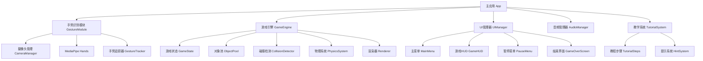

# 设计文档

## 概述

网页端水果忍者游戏是一个基于浏览器的实时互动游戏，核心技术栈包括：
- **前端框架**: HTML5 Canvas + JavaScript (或 TypeScript)
- **手势识别**: MediaPipe Hands (Google 的手部追踪库)
- **游戏引擎**: 自定义 2D 游戏引擎基于 Canvas API
- **物理引擎**: 轻量级自定义物理系统处理抛物线运动
- **音频**: Web Audio API

游戏采用模块化架构，将手势识别、游戏逻辑、渲染和UI分离，确保代码可维护性和性能优化。

## 架构

### 系统架构图



### 技术选型理由

1. **MediaPipe Hands**: Google 开发的高性能手部追踪解决方案，支持实时 21 个手部关键点检测，在浏览器中运行流畅
2. **Canvas API**: 原生 2D 渲染，性能优异，适合游戏开发
3. **Web Audio API**: 提供低延迟音频播放和音效混合能力
4. **TypeScript**: 类型安全，提升代码质量和可维护性

## 组件和接口

### 1. 手势识别模块 (GestureModule)

#### CameraManager
负责摄像头访问和视频流管理。

```typescript
interface CameraManager {
  // 请求摄像头权限并初始化
  initialize(): Promise<void>;
  
  // 获取视频流
  getVideoStream(): MediaStream;
  
  // 获取视频元素
  getVideoElement(): HTMLVideoElement;
  
  // 停止摄像头
  stop(): void;
  
  // 检查摄像头是否就绪
  isReady(): boolean;
}
```

#### GestureTracker
使用 MediaPipe Hands 追踪手部位置和移动。

```typescript
interface HandPosition {
  x: number;  // 归一化坐标 0-1
  y: number;
  z: number;  // 深度信息
  timestamp: number;
}

interface GestureTracker {
  // 初始化 MediaPipe
  initialize(videoElement: HTMLVideoElement): Promise<void>;
  
  // 开始追踪
  startTracking(): void;
  
  // 停止追踪
  stopTracking(): void;
  
  // 获取当前手部位置（食指尖端）
  getCurrentHandPosition(): HandPosition | null;
  
  // 获取手部移动轨迹（最近 N 帧）
  getHandTrail(frames: number): HandPosition[];
  
  // 检测是否有快速挥动动作
  detectSliceGesture(): boolean;
  
  // 注册手势事件监听
  onHandDetected(callback: (position: HandPosition) => void): void;
  onHandLost(callback: () => void): void;
}
```

### 2. 游戏引擎 (GameEngine)

#### GameObject
游戏对象基类。

```typescript
interface GameObject {
  id: string;
  type: 'fruit' | 'bomb';
  position: { x: number; y: number };
  velocity: { x: number; y: number };
  rotation: number;
  scale: number;
  isAlive: boolean;
  
  // 更新对象状态
  update(deltaTime: number): void;
  
  // 渲染对象
  render(ctx: CanvasRenderingContext2D): void;
  
  // 获取碰撞边界
  getBounds(): { x: number; y: number; width: number; height: number };
  
  // 被切割时调用
  onSliced(): void;
}
```

#### Fruit
水果对象实现。

```typescript
interface Fruit extends GameObject {
  fruitType: 'watermelon' | 'apple' | 'orange' | 'banana' | 'strawberry';
  sliceEffect: ParticleEffect;  // 切割粒子效果
  
  // 分裂成两半
  split(sliceAngle: number): [Fruit, Fruit];
}
```

#### Bomb
炸弹对象实现。

```typescript
interface Bomb extends GameObject {
  explosionEffect: ParticleEffect;
  
  // 爆炸
  explode(): void;
}
```

#### GameState
管理游戏状态。

```typescript
interface GameState {
  score: number;
  lives: number;
  isPlaying: boolean;
  isPaused: boolean;
  gameObjects: GameObject[];
  
  // 添加游戏对象
  addGameObject(obj: GameObject): void;
  
  // 移除游戏对象
  removeGameObject(id: string): void;
  
  // 增加分数
  addScore(points: number): void;
  
  // 减少生命
  loseLife(): void;
  
  // 重置游戏
  reset(): void;
}
```

#### ObjectPool
对象池优化性能。

```typescript
interface ObjectPool {
  // 获取水果对象
  getFruit(type: string): Fruit;
  
  // 获取炸弹对象
  getBomb(): Bomb;
  
  // 回收对象
  recycle(obj: GameObject): void;
  
  // 预加载对象
  preload(fruitCount: number, bombCount: number): void;
}
```

#### CollisionDetector
碰撞检测系统。

```typescript
interface CollisionDetector {
  // 检测手部轨迹与游戏对象的碰撞
  checkSliceCollision(
    handTrail: HandPosition[],
    gameObjects: GameObject[]
  ): GameObject[];
  
  // 线段与矩形相交检测
  lineIntersectsRect(
    line: { start: Point; end: Point },
    rect: { x: number; y: number; width: number; height: number }
  ): boolean;
}
```

#### PhysicsSystem
物理系统处理抛物线运动。

```typescript
interface PhysicsSystem {
  gravity: number;  // 重力加速度
  
  // 更新所有对象的物理状态
  update(gameObjects: GameObject[], deltaTime: number): void;
  
  // 生成随机抛物线参数
  generateThrowParams(): {
    startX: number;
    velocityX: number;
    velocityY: number;
    rotation: number;
  };
}
```

#### Renderer
渲染器负责绘制所有游戏元素。

```typescript
interface Renderer {
  canvas: HTMLCanvasElement;
  ctx: CanvasRenderingContext2D;
  
  // 清空画布
  clear(): void;
  
  // 渲染游戏对象
  renderGameObjects(objects: GameObject[]): void;
  
  // 渲染手部轨迹
  renderHandTrail(trail: HandPosition[]): void;
  
  // 渲染粒子效果
  renderParticles(particles: ParticleEffect[]): void;
  
  // 渲染背景
  renderBackground(): void;
}
```

### 3. UI管理器 (UIManager)

#### UIManager
管理所有UI界面。

```typescript
interface UIManager {
  currentScreen: 'menu' | 'game' | 'pause' | 'gameover' | 'tutorial';
  theme: SciFiTheme;
  
  // 显示指定界面
  showScreen(screen: string): void;
  
  // 更新游戏HUD
  updateHUD(score: number, lives: number): void;
  
  // 显示摄像头预览
  showCameraPreview(videoElement: HTMLVideoElement): void;
  
  // 渲染UI元素
  render(ctx: CanvasRenderingContext2D): void;
}
```

#### SciFiTheme
科幻主题配置。

```typescript
interface SciFiTheme {
  colors: {
    primary: string;      // 主色：霓虹青色 #00FFFF
    secondary: string;    // 次色：霓虹紫色 #FF00FF
    accent: string;       // 强调色：霓虹橙色 #FF6600
    background: string;   // 背景：深色 #0A0E27
    text: string;         // 文字：亮白 #FFFFFF
  };
  
  effects: {
    glowIntensity: number;      // 发光强度
    scanlineSpeed: number;      // 扫描线速度
    particleColor: string;      // 粒子颜色
  };
  
  fonts: {
    main: string;  // 'Orbitron' 或 'Rajdhani'
    mono: string;  // 'Share Tech Mono'
  };
  
  // 绘制霓虹边框
  drawNeonBorder(
    ctx: CanvasRenderingContext2D,
    x: number, y: number,
    width: number, height: number
  ): void;
  
  // 绘制发光文字
  drawGlowText(
    ctx: CanvasRenderingContext2D,
    text: string,
    x: number, y: number
  ): void;
  
  // 绘制扫描线效果
  drawScanlines(ctx: CanvasRenderingContext2D): void;
}
```

### 4. 音频管理器 (AudioManager)

```typescript
interface AudioManager {
  // 加载音频资源
  loadSounds(soundMap: Map<string, string>): Promise<void>;
  
  // 播放音效
  playSound(soundName: string, volume?: number): void;
  
  // 播放背景音乐
  playBackgroundMusic(musicName: string, loop: boolean): void;
  
  // 停止背景音乐
  stopBackgroundMusic(): void;
  
  // 设置主音量
  setMasterVolume(volume: number): void;
  
  // 静音/取消静音
  toggleMute(): void;
}
```

### 5. 教学系统 (TutorialSystem)

```typescript
interface TutorialStep {
  id: string;
  title: string;
  description: string;
  targetAction: 'detect_hand' | 'slice_fruit' | 'avoid_bomb';
  completed: boolean;
  
  // 检查步骤是否完成
  checkCompletion(gameState: GameState): boolean;
  
  // 渲染提示
  renderHint(ctx: CanvasRenderingContext2D): void;
}

interface TutorialSystem {
  steps: TutorialStep[];
  currentStepIndex: number;
  isActive: boolean;
  
  // 启动教程
  start(): void;
  
  // 更新教程状态
  update(gameState: GameState): void;
  
  // 进入下一步
  nextStep(): void;
  
  // 完成教程
  complete(): void;
  
  // 渲染教程UI
  render(ctx: CanvasRenderingContext2D): void;
}
```

## 数据模型

### 游戏配置

```typescript
interface GameConfig {
  // 游戏设置
  initialLives: number;              // 初始生命值：3
  fruitSpawnInterval: [number, number];  // 水果生成间隔：[500, 2000] ms
  bombSpawnChance: number;           // 炸弹生成概率：0.2
  fruitScore: number;                // 切割水果得分：10
  
  // 物理参数
  gravity: number;                   // 重力：980 px/s²
  minThrowVelocity: number;          // 最小抛出速度：800 px/s
  maxThrowVelocity: number;          // 最大抛出速度：1200 px/s
  
  // 手势识别参数
  handTrailLength: number;           // 手部轨迹长度：10 帧
  sliceVelocityThreshold: number;    // 切割速度阈值：500 px/s
  handTrailFadeTime: number;         // 轨迹淡出时间：300 ms
  
  // 渲染参数
  targetFPS: number;                 // 目标帧率：60
  canvasWidth: number;               // 画布宽度：1920
  canvasHeight: number;              // 画布高度：1080
}
```

### 本地存储数据

```typescript
interface SaveData {
  highScore: number;
  tutorialCompleted: boolean;
  soundEnabled: boolean;
  musicEnabled: boolean;
  masterVolume: number;
}
```

## 错误处理

### 摄像头访问错误

```typescript
enum CameraError {
  PERMISSION_DENIED = 'PERMISSION_DENIED',
  NOT_FOUND = 'NOT_FOUND',
  NOT_READABLE = 'NOT_READABLE',
  OVERCONSTRAINED = 'OVERCONSTRAINED',
  UNKNOWN = 'UNKNOWN'
}

interface ErrorHandler {
  // 处理摄像头错误
  handleCameraError(error: CameraError): void;
  
  // 显示用户友好的错误消息
  showErrorMessage(message: string): void;
  
  // 提供降级方案（使用鼠标代替手势）
  enableFallbackMode(): void;
}
```

### MediaPipe 加载失败

- 显示加载进度条
- 超时后提示用户刷新页面
- 提供离线模式（使用鼠标操作）

### 性能问题

- 监控帧率，低于 30 FPS 时降低粒子效果质量
- 限制同时存在的游戏对象数量（最多 10 个）
- 使用对象池减少 GC 压力

## 测试策略

### 单元测试

- 碰撞检测算法测试
- 物理系统计算测试
- 对象池管理测试
- 分数计算逻辑测试

### 集成测试

- 手势识别与游戏逻辑集成
- UI 交互流程测试
- 音频播放同步测试
- 教学系统完整流程测试

### 性能测试

- 帧率稳定性测试（目标：稳定 60 FPS）
- 内存泄漏检测
- 长时间运行稳定性测试
- 不同设备兼容性测试

### 用户体验测试

- 手势识别准确性测试
- 不同光照条件下的表现
- 响应延迟测试（目标：< 100ms）
- UI 可读性和美观度评估

## 性能优化

### 渲染优化

1. **离屏 Canvas**: 预渲染静态元素（背景、UI 框架）
2. **脏矩形**: 只重绘变化区域
3. **RequestAnimationFrame**: 使用浏览器优化的动画循环
4. **图层分离**: 游戏对象、粒子效果、UI 分层渲染

### 计算优化

1. **对象池**: 复用游戏对象，减少 GC
2. **空间分区**: 使用四叉树优化碰撞检测
3. **节流**: 限制手势识别更新频率（30 FPS）
4. **Web Worker**: 将 MediaPipe 计算移到后台线程

### 资源优化

1. **图片压缩**: 使用 WebP 格式
2. **音频压缩**: 使用 MP3/OGG 格式
3. **懒加载**: 按需加载资源
4. **CDN**: 使用 CDN 加载 MediaPipe 库

## 部署架构

### 静态网站托管

- 使用 Vercel/Netlify 部署
- 启用 HTTPS（摄像头访问必需）
- 配置 CDN 加速
- 启用 Gzip 压缩

### 浏览器兼容性

- Chrome 90+（推荐）
- Edge 90+
- Firefox 88+
- Safari 14+（iOS 需要 14.5+）

### 移动端适配

- 响应式设计，支持横屏和竖屏
- 触摸事件作为降级方案
- 优化移动端性能（降低粒子数量）
